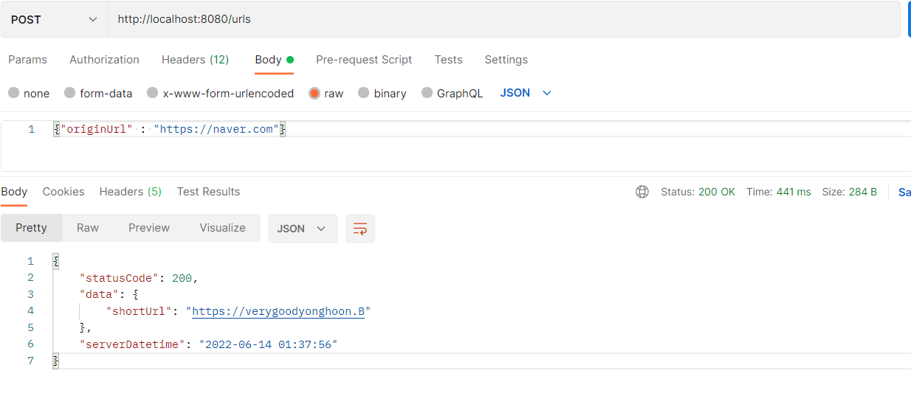
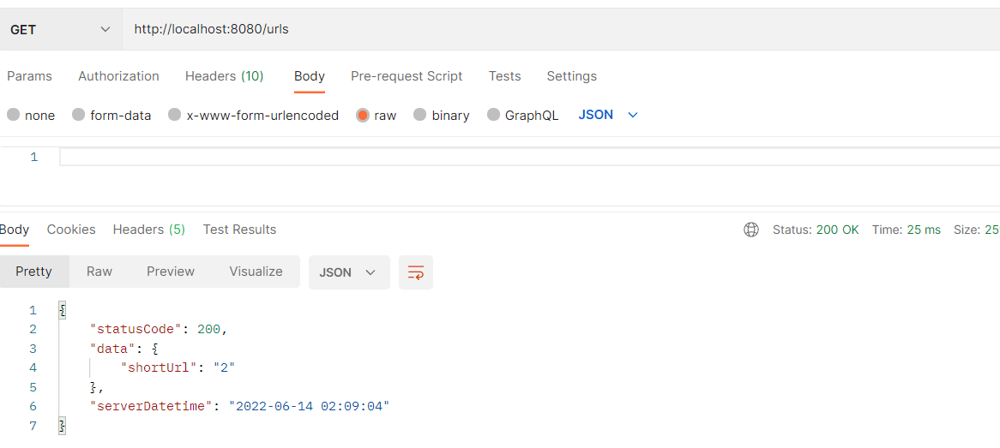

# springboot-url-shortener
SprintBoot URL Shortener 구현 미션 Repository 입니다.

## 요구사항
각 요구사항을 모두 충족할 수 있도록 노력해봅시다.
- [x] URL 입력폼 제공 및 결과 출력
- [x] URL Shortening Key는 8 Character 이내로 생성
- [x] 단축된 URL 요청시 원래 URL로 리다이렉트
- [x] 단축된 URL에 대한 요청 수 정보저장 (optional)
- [ ] Shortening Key를 생성하는 알고리즘 2개 이상 제공하며 애플리케이션 실행중 동적으로 변경 가능 (optional) 

## Short URL Service
### 읽으면 좋은 레퍼런스
- [Naver 단축 URL API](https://developers.naver.com/docs/utils/shortenurl/)
- [짧게 줄인 URL의 실제 URL 확인 원리 및 방법](https://metalkin.tistory.com/50)
- [짧게 줄인 URL 알고리즘 고찰](https://metalkin.tistory.com/53)
- [단축 URL 원리 및 개발](https://blog.siyeol.com/26)

### Short URL의 동작 과정
### 1. Url 등록 시 short url 생성

### 2. 수정된 Url 로 요청 시 원래 Url 로 redirect. redirect 는 302 로 이동하므로 방문 count 증가
### 3. 2번 방문 후 방문 count 측정 시 2로 증가됨을 확인할 수 있다.

